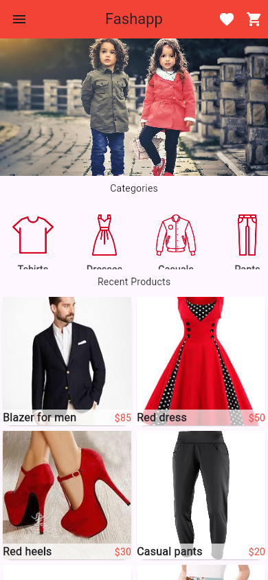
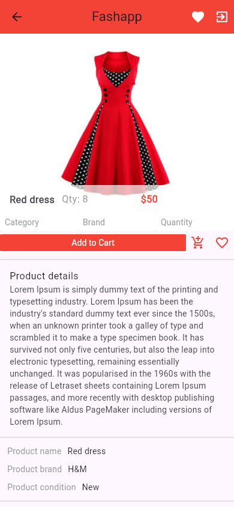
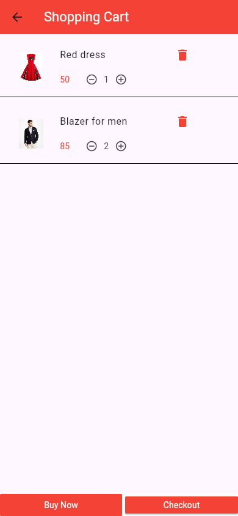
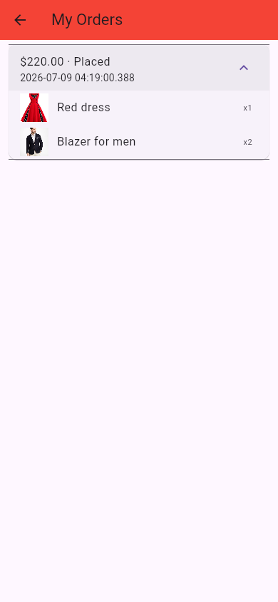

# Flushion — Flutter E-Commerce App

A Flutter + Firebase e-commerce app: browse products by category, add to cart
and favourites, checkout, and track orders. Originally built ~6 years ago as
one of my first Flutter projects; revamped in 2026 after the original
Firebase project quietly expired from years of inactivity.

## Status: mid-revamp

The app is fully functional again (see below), but the UI is still the
original 2020 design. A redesign is in progress — see the
[Canva mockup](https://canva.link/xd27feov4a6zhax) for where it's headed.
Track progress in [docs/MIGRATION.md](docs/MIGRATION.md).

## Screenshots

  
  
  
  
  

More screens in [mockups/](mockups/) — drawer, My Account, Settings, About,
Admin dashboard, Favourites, signup.

## Demo video

[demo/flushion_app_demo.webm](demo/flushion_app_demo.webm) — a ~55s walkthrough:
login → browse → add to favourites/cart → adjust quantity → checkout →
My Orders → My Account → Favourites → Settings → About → Admin → log out.
(WebM — plays in Chrome/Edge/Firefox/VLC.)

## Features

- Email/password and Google sign-in (Firebase Auth)
- Product catalog with categories, browsable by brand/category (Firestore)
- Cart with quantity controls — adding the same item again increases
  quantity instead of duplicating the line
- Favourites
- Checkout that creates a real order record
- Order history (My Orders)
- Editable profile (My Account) — name, phone, address
- Settings, About
- Admin dashboard (security-key gated) for managing products, categories,
  and brands, including image upload to Firebase Storage

## Tech stack

- Flutter 3.44 / Dart 3.12 (null-safe), web + Android targets
- Firebase: Auth, Cloud Firestore, Storage
- `google_sign_in` with the GIS `renderButton` flow on web (the classic
  popup flow can't return an `idToken` there)

## Getting started

1. Install the [Flutter SDK](https://docs.flutter.dev/get-started/install)
   and add it to your PATH.
2. `flutter pub get`
3. Set up your own Firebase project (Auth with Email/Password + Google
   enabled, Firestore, Storage) and drop its config into
   `lib/firebase_options.dart` and `android/app/google-services.json`.
4. `flutter run -d chrome` (web) or `flutter run` with an Android
   device/emulator attached.

See [docs/MIGRATION.md](docs/MIGRATION.md) for the full story of what it
took to get from a 6-year-old, dead-Firebase-project state to this.

## Medium Articles

- [I let AI resurrect my dead 6-year-old Flutter app — here’s what actually broke] (https://medium.com/@shahvidhijayesh/i-let-ai-resurrect-my-dead-6-year-old-flutter-app-heres-what-actually-broke-b131c6253f2f)
- [Reviving a 6-year-old Flutter app: the technical play-by-play] (https://medium.com/@shahvidhijayesh/reviving-a-6-year-old-flutter-app-the-technical-play-by-play-ed5b9aa472cc)
